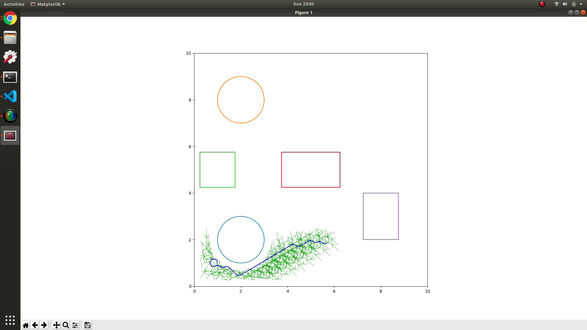
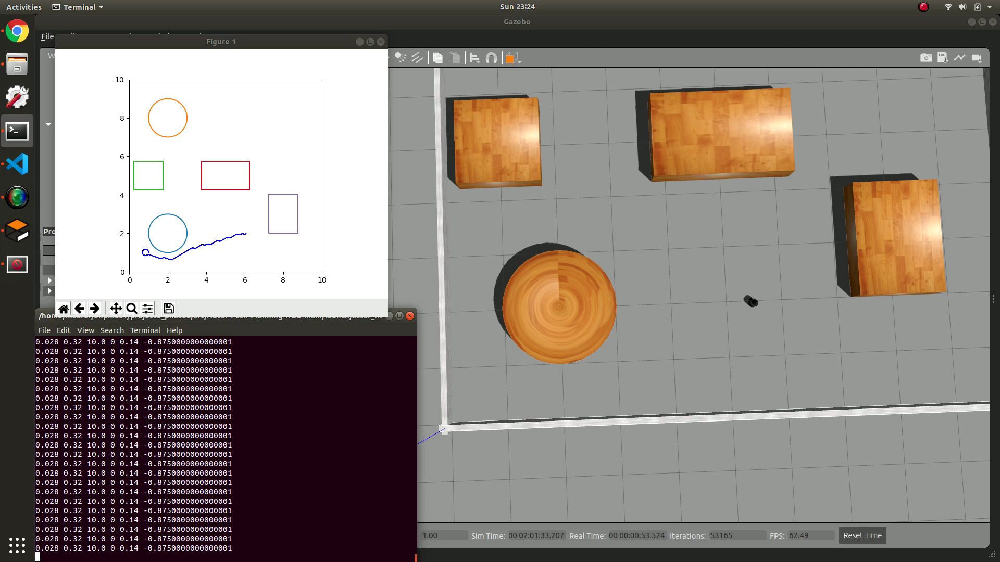

# Project 3 - Phase 2

# A Star path-planning for Turtlebot 3

UID: 117509717 | Maaruf Vazifdar

## Required packages

1. Python
2. Turtlebot 3

## Output Images





## Output Videos

[2D](results/2d.mp4)

[Gazebo](results/gazebo.mp4)

## Steps to Run

Build the workspace:

```bash
  cd ~/catkin_ws/src

  git clone https://github.com/maarufvazifdar/astar_planner_turtlebot.git
  
  cd ~/catkin_ws
  
  catkin_make

  source devel/setup.bash
```

### Part 1

Visualize 2D exploration and optimal path:

```bash
cd src/astar_planner_turtlebot/src/scripts

python simulation_2d.py --start_location="[1,1,90]" --goal_location="[6,2,0]" --RPM="[10,10]" --displayExploration=1
```

### Part 2

Visualize Gazebo simulation:

```bash
roslaunch astar_planner_turtlebot astar_turtlebot.launch start_location:="[1,1,90]" goal_location:="[6,2,0]" RPM:="[10,10]"
```
